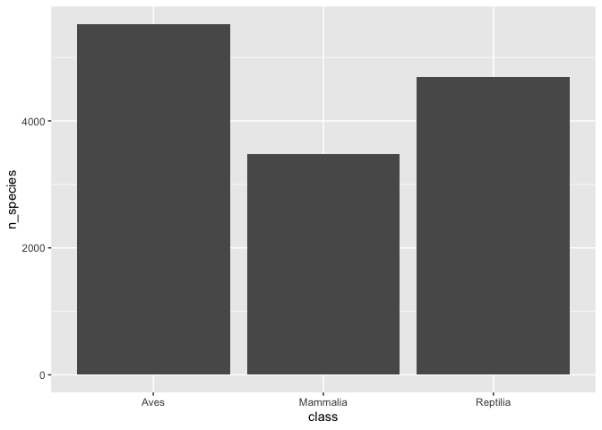
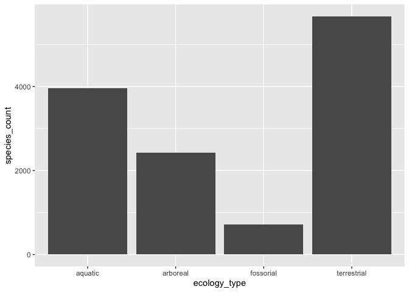
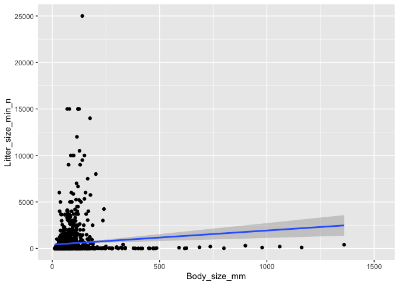
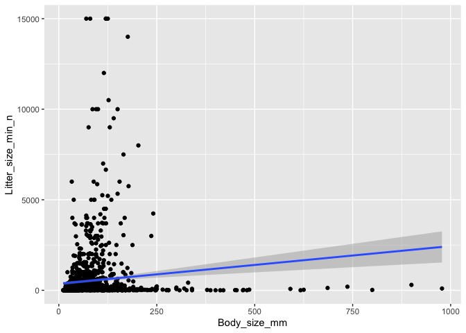

## Instructions
Answer the following questions and complete the exercises in RMarkdown. Please embed all of your code and push your final work to your repository. Your final lab report should be organized, clean, and run free from errors. Remember, you must remove the `#` for the included code chunks to run.  

## Libraries

```r
#install.packages("stringi")
library(tidyverse)
```

```
## <U+2500><U+2500> Attaching packages <U+2500><U+2500><U+2500><U+2500><U+2500><U+2500><U+2500><U+2500><U+2500><U+2500><U+2500><U+2500><U+2500><U+2500><U+2500><U+2500><U+2500><U+2500><U+2500><U+2500><U+2500><U+2500><U+2500><U+2500><U+2500><U+2500><U+2500><U+2500><U+2500><U+2500><U+2500><U+2500><U+2500><U+2500><U+2500><U+2500><U+2500><U+2500><U+2500><U+2500><U+2500><U+2500><U+2500><U+2500><U+2500><U+2500><U+2500><U+2500><U+2500><U+2500><U+2500><U+2500><U+2500><U+2500><U+2500><U+2500><U+2500><U+2500><U+2500><U+2500><U+2500><U+2500><U+2500><U+2500><U+2500><U+2500><U+2500><U+2500><U+2500><U+2500><U+2500><U+2500><U+2500><U+2500><U+2500><U+2500><U+2500><U+2500><U+2500><U+2500><U+2500><U+2500><U+2500><U+2500><U+2500><U+2500><U+2500><U+2500><U+2500><U+2500><U+2500><U+2500><U+2500><U+2500><U+2500><U+2500><U+2500><U+2500><U+2500><U+2500><U+2500><U+2500><U+2500><U+2500><U+2500> tidyverse 1.3.0 <U+2500><U+2500>
```

```
## <U+2713> ggplot2 3.2.1     <U+2713> purrr   0.3.3
## <U+2713> tibble  2.1.3     <U+2713> dplyr   0.8.3
## <U+2713> tidyr   1.0.0     <U+2713> stringr 1.4.0
## <U+2713> readr   1.3.1     <U+2713> forcats 0.4.0
```

```
## <U+2500><U+2500> Conflicts <U+2500><U+2500><U+2500><U+2500><U+2500><U+2500><U+2500><U+2500><U+2500><U+2500><U+2500><U+2500><U+2500><U+2500><U+2500><U+2500><U+2500><U+2500><U+2500><U+2500><U+2500><U+2500><U+2500><U+2500><U+2500><U+2500><U+2500><U+2500><U+2500><U+2500><U+2500><U+2500><U+2500><U+2500><U+2500><U+2500><U+2500><U+2500><U+2500><U+2500><U+2500><U+2500><U+2500><U+2500><U+2500><U+2500><U+2500><U+2500><U+2500><U+2500><U+2500><U+2500><U+2500><U+2500><U+2500><U+2500><U+2500><U+2500><U+2500><U+2500><U+2500><U+2500><U+2500><U+2500><U+2500><U+2500><U+2500><U+2500><U+2500><U+2500><U+2500><U+2500><U+2500><U+2500><U+2500><U+2500><U+2500><U+2500><U+2500><U+2500><U+2500><U+2500><U+2500><U+2500><U+2500><U+2500><U+2500><U+2500><U+2500><U+2500><U+2500><U+2500><U+2500><U+2500><U+2500><U+2500><U+2500><U+2500><U+2500><U+2500><U+2500><U+2500><U+2500><U+2500><U+2500><U+2500><U+2500><U+2500> tidyverse_conflicts() <U+2500><U+2500>
## x dplyr::filter() masks stats::filter()
## x dplyr::lag()    masks stats::lag()
```

```r
library(naniar)
library(skimr)
```

```
## 
## Attaching package: 'skimr'
```

```
## The following object is masked from 'package:naniar':
## 
##     n_complete
```

## Data
For this homework, we will use two different data sets. Please load `amniota` and `amphibio`.  

### `amniota` data
Myhrvold N, Baldridge E, Chan B, Sivam D, Freeman DL, Ernest SKM (2015). “An amniote life-history
database to perform comparative analyses with birds, mammals, and reptiles.” _Ecology_, *96*, 3109.
doi: 10.1890/15-0846.1 (URL: https://doi.org/10.1890/15-0846.1).

```r
amniota <- 
  readr::read_csv("data/amniota.csv")
```

```
## Parsed with column specification:
## cols(
##   .default = col_double(),
##   class = col_character(),
##   order = col_character(),
##   family = col_character(),
##   genus = col_character(),
##   species = col_character(),
##   common_name = col_character()
## )
```

```
## See spec(...) for full column specifications.
```

### `amphibio` data
Oliveira BF, São-Pedro VA, Santos-Barrera G, Penone C, Costa GC (2017). “AmphiBIO, a global database
for amphibian ecological traits.” _Scientific Data_, *4*, 170123. doi: 10.1038/sdata.2017.123 (URL:
https://doi.org/10.1038/sdata.2017.123).

```r
amphibio <- 
  readr::read_csv("data/amphibio.csv")
```

```
## Parsed with column specification:
## cols(
##   .default = col_double(),
##   id = col_character(),
##   Order = col_character(),
##   Family = col_character(),
##   Genus = col_character(),
##   Species = col_character(),
##   Seeds = col_logical(),
##   OBS = col_logical()
## )
```

```
## See spec(...) for full column specifications.
```

```
## Warning: 125 parsing failures.
##  row col           expected                                                           actual                file
## 1410 OBS 1/0/T/F/TRUE/FALSE Identified as P. appendiculata in Boquimpani-Freitas et al. 2002 'data/amphibio.csv'
## 1416 OBS 1/0/T/F/TRUE/FALSE Identified as T. miliaris in Giaretta and Facure 2004            'data/amphibio.csv'
## 1447 OBS 1/0/T/F/TRUE/FALSE Considered endangered by Soto-Azat et al. 2013                   'data/amphibio.csv'
## 1448 OBS 1/0/T/F/TRUE/FALSE Considered extinct by Soto-Azat et al. 2013                      'data/amphibio.csv'
## 1471 OBS 1/0/T/F/TRUE/FALSE nomem dubitum                                                    'data/amphibio.csv'
## .... ... .................. ................................................................ ...................
## See problems(...) for more details.
```

## Questions  
**1. First, do some exploratory analysis of both data sets. What is the structure, column names, and dimensions?**  

```r
str(amniota)
```

```
## Classes 'spec_tbl_df', 'tbl_df', 'tbl' and 'data.frame':	21322 obs. of  36 variables:
##  $ class                                : chr  "Aves" "Aves" "Aves" "Aves" ...
##  $ order                                : chr  "Accipitriformes" "Accipitriformes" "Accipitriformes" "Accipitriformes" ...
##  $ family                               : chr  "Accipitridae" "Accipitridae" "Accipitridae" "Accipitridae" ...
##  $ genus                                : chr  "Accipiter" "Accipiter" "Accipiter" "Accipiter" ...
##  $ species                              : chr  "albogularis" "badius" "bicolor" "brachyurus" ...
##  $ subspecies                           : num  -999 -999 -999 -999 -999 -999 -999 -999 -999 -999 ...
##  $ common_name                          : chr  "Pied Goshawk" "Shikra" "Bicolored Hawk" "New Britain Sparrowhawk" ...
##  $ female_maturity_d                    : num  -999 363 -999 -999 363 ...
##  $ litter_or_clutch_size_n              : num  -999 3.25 2.7 -999 4 -999 2.7 4.25 3.25 4.35 ...
##  $ litters_or_clutches_per_y            : num  -999 1 -999 -999 1 -999 -999 1 -999 1 ...
##  $ adult_body_mass_g                    : num  252 140 345 142 204 ...
##  $ maximum_longevity_y                  : num  -999 -999 -999 -999 -999 ...
##  $ gestation_d                          : num  -999 -999 -999 -999 -999 -999 -999 -999 -999 -999 ...
##  $ weaning_d                            : num  -999 -999 -999 -999 -999 -999 -999 -999 -999 -999 ...
##  $ birth_or_hatching_weight_g           : num  -999 -999 -999 -999 -999 -999 -999 -999 -999 28 ...
##  $ weaning_weight_g                     : num  -999 -999 -999 -999 -999 -999 -999 -999 -999 -999 ...
##  $ egg_mass_g                           : num  -999 21 32 -999 21.9 ...
##  $ incubation_d                         : num  -999 30 -999 -999 32.5 ...
##  $ fledging_age_d                       : num  -999 32 -999 -999 42.5 ...
##  $ longevity_y                          : num  -999 -999 -999 -999 -999 ...
##  $ male_maturity_d                      : num  -999 -999 -999 -999 -999 -999 -999 365 -999 730 ...
##  $ inter_litter_or_interbirth_interval_y: num  -999 -999 -999 -999 -999 -999 -999 -999 -999 -999 ...
##  $ female_body_mass_g                   : num  352 168 390 -999 230 ...
##  $ male_body_mass_g                     : num  223 125 212 142 170 ...
##  $ no_sex_body_mass_g                   : num  -999 123 -999 -999 -999 ...
##  $ egg_width_mm                         : num  -999 -999 -999 -999 -999 -999 -999 -999 -999 -999 ...
##  $ egg_length_mm                        : num  -999 -999 -999 -999 -999 -999 -999 -999 -999 -999 ...
##  $ fledging_mass_g                      : num  -999 -999 -999 -999 -999 -999 -999 -999 -999 -999 ...
##  $ adult_svl_cm                         : num  -999 30 39.5 -999 33.5 -999 39.5 29 32.5 42 ...
##  $ male_svl_cm                          : num  -999 -999 -999 -999 -999 -999 -999 -999 -999 -999 ...
##  $ female_svl_cm                        : num  -999 -999 -999 -999 -999 -999 -999 -999 -999 -999 ...
##  $ birth_or_hatching_svl_cm             : num  -999 -999 -999 -999 -999 -999 -999 -999 -999 -999 ...
##  $ female_svl_at_maturity_cm            : num  -999 -999 -999 -999 -999 -999 -999 -999 -999 -999 ...
##  $ female_body_mass_at_maturity_g       : num  -999 -999 -999 -999 -999 -999 -999 -999 -999 -999 ...
##  $ no_sex_svl_cm                        : num  -999 -999 -999 -999 -999 -999 -999 -999 -999 -999 ...
##  $ no_sex_maturity_d                    : num  -999 -999 -999 -999 -999 -999 -999 -999 -999 -999 ...
##  - attr(*, "spec")=
##   .. cols(
##   ..   class = col_character(),
##   ..   order = col_character(),
##   ..   family = col_character(),
##   ..   genus = col_character(),
##   ..   species = col_character(),
##   ..   subspecies = col_double(),
##   ..   common_name = col_character(),
##   ..   female_maturity_d = col_double(),
##   ..   litter_or_clutch_size_n = col_double(),
##   ..   litters_or_clutches_per_y = col_double(),
##   ..   adult_body_mass_g = col_double(),
##   ..   maximum_longevity_y = col_double(),
##   ..   gestation_d = col_double(),
##   ..   weaning_d = col_double(),
##   ..   birth_or_hatching_weight_g = col_double(),
##   ..   weaning_weight_g = col_double(),
##   ..   egg_mass_g = col_double(),
##   ..   incubation_d = col_double(),
##   ..   fledging_age_d = col_double(),
##   ..   longevity_y = col_double(),
##   ..   male_maturity_d = col_double(),
##   ..   inter_litter_or_interbirth_interval_y = col_double(),
##   ..   female_body_mass_g = col_double(),
##   ..   male_body_mass_g = col_double(),
##   ..   no_sex_body_mass_g = col_double(),
##   ..   egg_width_mm = col_double(),
##   ..   egg_length_mm = col_double(),
##   ..   fledging_mass_g = col_double(),
##   ..   adult_svl_cm = col_double(),
##   ..   male_svl_cm = col_double(),
##   ..   female_svl_cm = col_double(),
##   ..   birth_or_hatching_svl_cm = col_double(),
##   ..   female_svl_at_maturity_cm = col_double(),
##   ..   female_body_mass_at_maturity_g = col_double(),
##   ..   no_sex_svl_cm = col_double(),
##   ..   no_sex_maturity_d = col_double()
##   .. )
```


```r
colnames(amniota)
```

```
##  [1] "class"                                
##  [2] "order"                                
##  [3] "family"                               
##  [4] "genus"                                
##  [5] "species"                              
##  [6] "subspecies"                           
##  [7] "common_name"                          
##  [8] "female_maturity_d"                    
##  [9] "litter_or_clutch_size_n"              
## [10] "litters_or_clutches_per_y"            
## [11] "adult_body_mass_g"                    
## [12] "maximum_longevity_y"                  
## [13] "gestation_d"                          
## [14] "weaning_d"                            
## [15] "birth_or_hatching_weight_g"           
## [16] "weaning_weight_g"                     
## [17] "egg_mass_g"                           
## [18] "incubation_d"                         
## [19] "fledging_age_d"                       
## [20] "longevity_y"                          
## [21] "male_maturity_d"                      
## [22] "inter_litter_or_interbirth_interval_y"
## [23] "female_body_mass_g"                   
## [24] "male_body_mass_g"                     
## [25] "no_sex_body_mass_g"                   
## [26] "egg_width_mm"                         
## [27] "egg_length_mm"                        
## [28] "fledging_mass_g"                      
## [29] "adult_svl_cm"                         
## [30] "male_svl_cm"                          
## [31] "female_svl_cm"                        
## [32] "birth_or_hatching_svl_cm"             
## [33] "female_svl_at_maturity_cm"            
## [34] "female_body_mass_at_maturity_g"       
## [35] "no_sex_svl_cm"                        
## [36] "no_sex_maturity_d"
```


```r
dim(amniota)
```

```
## [1] 21322    36
```


```r
str(amphibio)
```

```
## Classes 'spec_tbl_df', 'tbl_df', 'tbl' and 'data.frame':	6776 obs. of  38 variables:
##  $ id                     : chr  "Anf0001" "Anf0002" "Anf0003" "Anf0004" ...
##  $ Order                  : chr  "Anura" "Anura" "Anura" "Anura" ...
##  $ Family                 : chr  "Allophrynidae" "Alytidae" "Alytidae" "Alytidae" ...
##  $ Genus                  : chr  "Allophryne" "Alytes" "Alytes" "Alytes" ...
##  $ Species                : chr  "Allophryne ruthveni" "Alytes cisternasii" "Alytes dickhilleni" "Alytes maurus" ...
##  $ Fos                    : num  NA NA NA NA NA 1 1 1 1 1 ...
##  $ Ter                    : num  1 1 1 1 1 1 1 1 1 1 ...
##  $ Aqu                    : num  1 1 1 1 NA 1 1 1 1 1 ...
##  $ Arb                    : num  1 1 1 1 1 1 NA NA NA NA ...
##  $ Leaves                 : num  NA NA NA NA NA NA NA NA NA NA ...
##  $ Flowers                : num  NA NA NA NA NA NA NA NA NA NA ...
##  $ Seeds                  : logi  NA NA NA NA NA NA ...
##  $ Fruits                 : num  NA NA NA NA NA NA NA NA NA NA ...
##  $ Arthro                 : num  1 1 1 NA 1 1 1 1 1 NA ...
##  $ Vert                   : num  NA NA NA NA NA NA 1 NA NA NA ...
##  $ Diu                    : num  1 NA NA NA NA NA 1 1 1 NA ...
##  $ Noc                    : num  1 1 1 NA 1 1 1 1 1 NA ...
##  $ Crepu                  : num  1 NA NA NA NA 1 NA NA NA NA ...
##  $ Wet_warm               : num  NA NA NA NA 1 1 NA NA NA NA ...
##  $ Wet_cold               : num  1 NA NA NA NA NA 1 NA NA NA ...
##  $ Dry_warm               : num  NA NA NA NA NA NA NA NA NA NA ...
##  $ Dry_cold               : num  NA NA NA NA NA NA NA NA NA NA ...
##  $ Body_mass_g            : num  31 6.1 NA NA 2.31 13.4 21.8 NA NA NA ...
##  $ Age_at_maturity_min_y  : num  NA 2 2 NA 3 2 3 NA NA NA ...
##  $ Age_at_maturity_max_y  : num  NA 2 2 NA 3 3 5 NA NA NA ...
##  $ Body_size_mm           : num  31 50 55 NA 40 55 80 60 65 NA ...
##  $ Size_at_maturity_min_mm: num  NA 27 NA NA NA 35 NA NA NA NA ...
##  $ Size_at_maturity_max_mm: num  NA 36 NA NA NA 40.5 NA NA NA NA ...
##  $ Longevity_max_y        : num  NA 6 NA NA NA 7 9 NA NA NA ...
##  $ Litter_size_min_n      : num  300 60 40 NA 7 53 300 1500 1000 NA ...
##  $ Litter_size_max_n      : num  300 180 40 NA 20 171 1500 1500 1000 NA ...
##  $ Reproductive_output_y  : num  1 4 1 4 1 4 6 1 1 1 ...
##  $ Offspring_size_min_mm  : num  NA 2.6 NA NA 5.4 2.6 1.5 NA 1.5 NA ...
##  $ Offspring_size_max_mm  : num  NA 3.5 NA NA 7 5 2 NA 1.5 NA ...
##  $ Dir                    : num  0 0 0 0 0 0 0 0 0 0 ...
##  $ Lar                    : num  1 1 1 1 1 1 1 1 1 1 ...
##  $ Viv                    : num  0 0 0 0 0 0 0 0 0 0 ...
##  $ OBS                    : logi  NA NA NA NA NA NA ...
##  - attr(*, "problems")=Classes 'tbl_df', 'tbl' and 'data.frame':	125 obs. of  5 variables:
##   ..$ row     : int  1410 1416 1447 1448 1471 1488 1539 1540 1543 1544 ...
##   ..$ col     : chr  "OBS" "OBS" "OBS" "OBS" ...
##   ..$ expected: chr  "1/0/T/F/TRUE/FALSE" "1/0/T/F/TRUE/FALSE" "1/0/T/F/TRUE/FALSE" "1/0/T/F/TRUE/FALSE" ...
##   ..$ actual  : chr  "Identified as P. appendiculata in Boquimpani-Freitas et al. 2002" "Identified as T. miliaris in Giaretta and Facure 2004" "Considered endangered by Soto-Azat et al. 2013" "Considered extinct by Soto-Azat et al. 2013" ...
##   ..$ file    : chr  "'data/amphibio.csv'" "'data/amphibio.csv'" "'data/amphibio.csv'" "'data/amphibio.csv'" ...
##  - attr(*, "spec")=
##   .. cols(
##   ..   id = col_character(),
##   ..   Order = col_character(),
##   ..   Family = col_character(),
##   ..   Genus = col_character(),
##   ..   Species = col_character(),
##   ..   Fos = col_double(),
##   ..   Ter = col_double(),
##   ..   Aqu = col_double(),
##   ..   Arb = col_double(),
##   ..   Leaves = col_double(),
##   ..   Flowers = col_double(),
##   ..   Seeds = col_logical(),
##   ..   Fruits = col_double(),
##   ..   Arthro = col_double(),
##   ..   Vert = col_double(),
##   ..   Diu = col_double(),
##   ..   Noc = col_double(),
##   ..   Crepu = col_double(),
##   ..   Wet_warm = col_double(),
##   ..   Wet_cold = col_double(),
##   ..   Dry_warm = col_double(),
##   ..   Dry_cold = col_double(),
##   ..   Body_mass_g = col_double(),
##   ..   Age_at_maturity_min_y = col_double(),
##   ..   Age_at_maturity_max_y = col_double(),
##   ..   Body_size_mm = col_double(),
##   ..   Size_at_maturity_min_mm = col_double(),
##   ..   Size_at_maturity_max_mm = col_double(),
##   ..   Longevity_max_y = col_double(),
##   ..   Litter_size_min_n = col_double(),
##   ..   Litter_size_max_n = col_double(),
##   ..   Reproductive_output_y = col_double(),
##   ..   Offspring_size_min_mm = col_double(),
##   ..   Offspring_size_max_mm = col_double(),
##   ..   Dir = col_double(),
##   ..   Lar = col_double(),
##   ..   Viv = col_double(),
##   ..   OBS = col_logical()
##   .. )
```


```r
colnames(amphibio)
```

```
##  [1] "id"                      "Order"                  
##  [3] "Family"                  "Genus"                  
##  [5] "Species"                 "Fos"                    
##  [7] "Ter"                     "Aqu"                    
##  [9] "Arb"                     "Leaves"                 
## [11] "Flowers"                 "Seeds"                  
## [13] "Fruits"                  "Arthro"                 
## [15] "Vert"                    "Diu"                    
## [17] "Noc"                     "Crepu"                  
## [19] "Wet_warm"                "Wet_cold"               
## [21] "Dry_warm"                "Dry_cold"               
## [23] "Body_mass_g"             "Age_at_maturity_min_y"  
## [25] "Age_at_maturity_max_y"   "Body_size_mm"           
## [27] "Size_at_maturity_min_mm" "Size_at_maturity_max_mm"
## [29] "Longevity_max_y"         "Litter_size_min_n"      
## [31] "Litter_size_max_n"       "Reproductive_output_y"  
## [33] "Offspring_size_min_mm"   "Offspring_size_max_mm"  
## [35] "Dir"                     "Lar"                    
## [37] "Viv"                     "OBS"
```


```r
dim(amphibio)
```

```
## [1] 6776   38
```

**2. How many total NAs are in each data set? Do these values make sense? Are NAs represented by any other values?**   

```r
amniota %>%
  purrr::map_df(~ sum(is.na(.)))
```

```
## # A tibble: 1 x 36
##   class order family genus species subspecies common_name female_maturity<U+2026>
##   <int> <int>  <int> <int>   <int>      <int>       <int>            <int>
## 1     0     0      0     0       0          0           0                0
## # <U+2026> with 28 more variables: litter_or_clutch_size_n <int>,
## #   litters_or_clutches_per_y <int>, adult_body_mass_g <int>,
## #   maximum_longevity_y <int>, gestation_d <int>, weaning_d <int>,
## #   birth_or_hatching_weight_g <int>, weaning_weight_g <int>, egg_mass_g <int>,
## #   incubation_d <int>, fledging_age_d <int>, longevity_y <int>,
## #   male_maturity_d <int>, inter_litter_or_interbirth_interval_y <int>,
## #   female_body_mass_g <int>, male_body_mass_g <int>, no_sex_body_mass_g <int>,
## #   egg_width_mm <int>, egg_length_mm <int>, fledging_mass_g <int>,
## #   adult_svl_cm <int>, male_svl_cm <int>, female_svl_cm <int>,
## #   birth_or_hatching_svl_cm <int>, female_svl_at_maturity_cm <int>,
## #   female_body_mass_at_maturity_g <int>, no_sex_svl_cm <int>,
## #   no_sex_maturity_d <int>
```

```r
amphibio %>%
  purrr::map_df(~ sum(is.na(.))) %>% 
  pivot_longer(everything(),
    names_to= "variables",
    values_to = "num_nas") %>% 
  arrange(desc(num_nas))
```

```
## # A tibble: 38 x 2
##    variables num_nas
##    <chr>       <int>
##  1 OBS          6776
##  2 Fruits       6774
##  3 Flowers      6772
##  4 Seeds        6772
##  5 Leaves       6752
##  6 Dry_cold     6735
##  7 Vert         6657
##  8 Wet_cold     6625
##  9 Crepu        6608
## 10 Dry_warm     6572
## # <U+2026> with 28 more rows
```

**3. Make any necessary replacements in the data such that all NAs appear as "NA".**   

```r
amniota <- amniota %>%
  na_if("-999")
```


```r
amniota %>%
  purrr::map_df(~ sum(is.na(.))) %>%
  pivot_longer(everything(),
    names_to= "variables",
    values_to = "num_nas") %>% 
  arrange(desc(num_nas))
```

```
## # A tibble: 36 x 2
##    variables                      num_nas
##    <chr>                            <int>
##  1 subspecies                       21322
##  2 female_body_mass_at_maturity_g   21318
##  3 female_svl_at_maturity_cm        21120
##  4 fledging_mass_g                  21111
##  5 male_svl_cm                      21040
##  6 no_sex_maturity_d                20860
##  7 egg_width_mm                     20727
##  8 egg_length_mm                    20702
##  9 weaning_weight_g                 20258
## 10 female_svl_cm                    20242
## # <U+2026> with 26 more rows
```

**4. Use the package `naniar` to produce a summary, including percentages, of missing data in each column for both data sets.**  

```r
naniar::miss_var_summary(amniota)
```

```
## # A tibble: 36 x 3
##    variable                       n_miss pct_miss
##    <chr>                           <int>    <dbl>
##  1 subspecies                      21322    100  
##  2 female_body_mass_at_maturity_g  21318    100. 
##  3 female_svl_at_maturity_cm       21120     99.1
##  4 fledging_mass_g                 21111     99.0
##  5 male_svl_cm                     21040     98.7
##  6 no_sex_maturity_d               20860     97.8
##  7 egg_width_mm                    20727     97.2
##  8 egg_length_mm                   20702     97.1
##  9 weaning_weight_g                20258     95.0
## 10 female_svl_cm                   20242     94.9
## # <U+2026> with 26 more rows
```

```r
naniar::miss_var_summary(amphibio)
```

```
## # A tibble: 38 x 3
##    variable n_miss pct_miss
##    <chr>     <int>    <dbl>
##  1 OBS        6776    100  
##  2 Fruits     6774    100. 
##  3 Flowers    6772     99.9
##  4 Seeds      6772     99.9
##  5 Leaves     6752     99.6
##  6 Dry_cold   6735     99.4
##  7 Vert       6657     98.2
##  8 Wet_cold   6625     97.8
##  9 Crepu      6608     97.5
## 10 Dry_warm   6572     97.0
## # <U+2026> with 28 more rows
```

**5. For the `amniota` data, calculate the number of NAs in the `egg_mass_g` column sorted by taxonomic class; i.e. how many NAs are present in the `egg_mass_g` column in birds, mammals, and reptiles? Does this results make sense biologically? How do these results affect your interpretation of NAs?**  


```r
amniota %>%
  group_by(class) %>% 
  select(class, egg_mass_g) %>% 
  naniar::miss_var_summary(order=T)
```

```
## Warning: `cols` is now required.
## Please use `cols = c(data)`
```

```
## # A tibble: 3 x 4
## # Groups:   class [3]
##   class    variable   n_miss pct_miss
##   <chr>    <chr>       <int>    <dbl>
## 1 Aves     egg_mass_g   4914     50.1
## 2 Mammalia egg_mass_g   4953    100  
## 3 Reptilia egg_mass_g   6040     92.0
```
### Every value for for egg_mass_g in mammals is 'NA' because they don't lay eggs. This changes our interpretation of NAs because there are cases where we do not have the data such as for egg_mass_g in birds and reptiles and there are cases where it is not applicable such as egg_mass_g in mammals.

**6. Which taxonomic classes are represented in the data? Summarize this in a chart then make a barplot that shows the proportion of observations in each taxonomic class.**

```r
amniota %>% 
  group_by(class) %>% 
  ggplot(aes(x=class)) +
  geom_bar(stat = "count")
```

<!-- -->
  
**7. Let's explore the taxonomic composition of the data a bit more. How many genera are represented by taxonomic class? Present this as a data table and bar plot.**

```r
amniota %>%
  group_by(class) %>%
  summarize(n_genera=n_distinct(genus))
```

```
## # A tibble: 3 x 2
##   class    n_genera
##   <chr>       <int>
## 1 Aves         2169
## 2 Mammalia     1200
## 3 Reptilia      967
```


```r
amniota %>%
  group_by(class) %>%
  summarize(n_genera=n_distinct(genus)) %>% 
  ggplot(aes(x=class, y=n_genera)) +
  geom_bar(stat = "identity")
```

<!-- -->

**8. Lastly, how many species are represented in each taxonomic class? Present this as a data table and bar plot.**

```r
amniota %>%
  group_by(class) %>%
  summarize(n_species=n_distinct(species))
```

```
## # A tibble: 3 x 2
##   class    n_species
##   <chr>        <int>
## 1 Aves          5525
## 2 Mammalia      3473
## 3 Reptilia      4692
```


```r
amniota %>%
  group_by(class) %>%
  summarize(n_species=n_distinct(species)) %>% 
  ggplot(aes(x=class, y=n_species)) +
  geom_bar(stat = "identity")
```

<!-- -->

**9. The `amphibio` data includes information on ecology. Each species is classified as fossorial, terrestrial, aquatic, or arboreal. How many species are in each of these categories? Make a bar plot to visualize these results. Which category is most/ least represented in the data?**

```r
amphibio %>% 
  select(species=Species, fossorial=Fos, terrestrial=Ter, aquatic=Aqu, arboreal=Arb) %>%   pivot_longer(-species,
                names_to = "ecology_type",
                values_to = "count") %>% 
  group_by(ecology_type) %>% 
  summarize(species_count=sum(count, na.rm=T)) %>% 
  ggplot(aes(x=ecology_type, y=species_count)) +
  geom_bar(stat = "identity")
```

<!-- -->
### Terrestrial ecology is the most represented and aquatic ecology is the least represented.

**10. For the amphibio data, we are interested to know if body size is correlated with litter size? Make a plot that shows this relationship. You should notice that there are outliers. Can you think of a way to identify the outliers for both body size and litter size? What happens when you then re-plot the data?**

```r
amphibio %>%
  ggplot(aes(x=Body_size_mm, y=Litter_size_min_n)) +
  geom_point(na.rm=T) +
  geom_smooth(method = lm)
```

```
## Warning: Removed 5181 rows containing non-finite values (stat_smooth).
```

<!-- -->

```r
amphibio %>%
  filter(Body_size_mm <=1000 & Litter_size_min_n<=20000) %>% 
  ggplot(aes(x=Body_size_mm, y=Litter_size_min_n)) +
  geom_point(na.rm=T) +
  geom_smooth(method = lm)
```

<!-- -->


## Push your final code to GitHub!
Please be sure that you check the `keep md` file in the knit preferences. 
