## Learning Goals
*At the end of this exercise, you will be able to:*    
1. Build stacked barplots of categorical variables.  
2. Build side-by-side barplots using `position= "dodge"`.  
3. Build histograms and density plots.  
4. Create new categories with `case_when()`.

## Resources
- [ggplot2 cheatsheet](https://www.rstudio.com/wp-content/uploads/2015/03/ggplot2-cheatsheet.pdf)

## Libraries

```r
library(tidyverse)
options(scipen=999) #cancels the use of scientific notation for the session
```

## Data
**Database of vertebrate home range sizes.**  
Reference: Tamburello N, Cote IM, Dulvy NK (2015) Energy and the scaling of animal space use. The American Naturalist 186(2):196-211. http://dx.doi.org/10.1086/682070.  
Data: http://datadryad.org/resource/doi:10.5061/dryad.q5j65/1  


```r
homerange <- readr::read_csv("data/Tamburelloetal_HomeRangeDatabase.csv", na = c("", "NA", "\\"))
```

Note that when making this tutorial, we noticed a stray backtick in a cell under the primary method category. We want to set this to NA, so we include it in the list of NA indicators we have in our data (`"\\"`).

```r
homerange %>% 
  count(primarymethod)
```

```
## # A tibble: 7 x 2
##   primarymethod          n
##   <chr>              <int>
## 1 direct observation    93
## 2 mark-recapture        45
## 3 radiotag               2
## 4 telemetry            138
## 5 telemetry*           288
## 6 thread-trailing        1
## 7 <NA>                   2
```

## Barplots and multiple variables
Last time we explored the `fill` option in boxplots as a way to bring color to the plot; i.e. we filled by the same variable that we were plotting. What happens when we fill by a different categorical variable?  

Let's start by counting how many obervations we have in each taxonomic group.

```r
homerange %>% 
  count(taxon, sort=T)
```

```
## # A tibble: 9 x 2
##   taxon             n
##   <chr>         <int>
## 1 mammals         238
## 2 birds           140
## 3 marine fishes    90
## 4 snakes           41
## 5 river fishes     14
## 6 turtles          14
## 7 tortoises        12
## 8 lizards          11
## 9 lake fishes       9
```

Now let's make a barplot of these data.

```r
homerange %>% 
  ggplot(aes(x = taxon)) +
  geom_bar() +
  coord_flip() +
  labs(title = "Observations by Taxon in Homerange Data",
       x = "Taxonomic Group")
```

<!-- -->

By specifying `fill=trophic.guild` we build a stacked bar plot that shows the proportion of a given taxonomic group that is an herbivore or carnivore.

```r
homerange %>% 
  ggplot(aes(x = taxon, fill = trophic.guild)) +
  geom_bar() +
  coord_flip() +
  labs(title = "Observations by Taxon in Homerange Data",
       x = "Taxonomic Group",
       fill = "Trophic Guild")
```

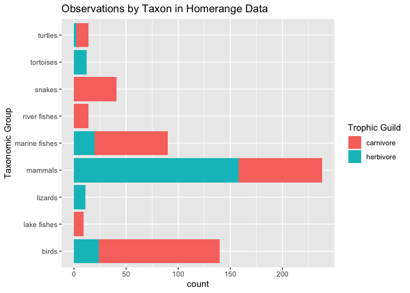<!-- -->

We can also have counts of each trophic guild within taxonomic group shown side-by-side by specifying `position="dodge"`.

```r
homerange %>% 
  ggplot(aes(x = taxon, fill = trophic.guild)) +
  geom_bar(position = "dodge") +
  coord_flip() +
  labs(title = "Observations by Taxon in Homerange Data",
       x = "Taxonomic Group",
       fill = "Trophic Guild")
```

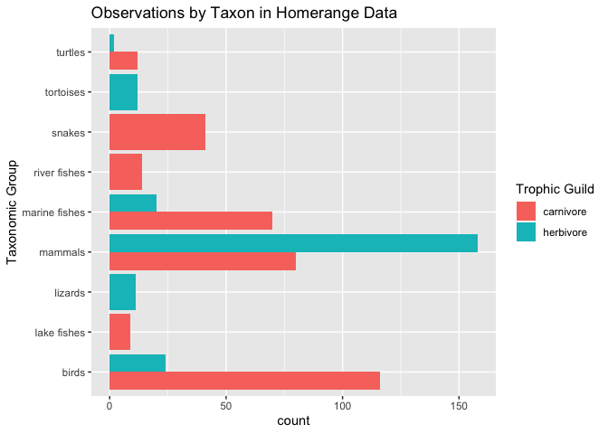<!-- -->

Here is the same plot oriented vertically.

```r
homerange %>% 
  ggplot(aes(x = taxon, fill = trophic.guild)) +
  geom_bar(position = "dodge") +
  theme(axis.text.x = element_text(angle = 60, hjust = 1)) +
  labs(title = "Observations by Taxon in Homerange Data",
       x = "Taxonomic Group",
       fill= "Trophic Guild")
```

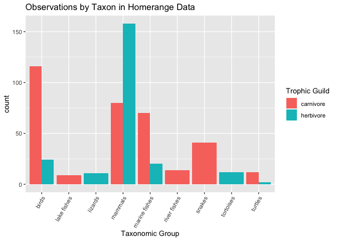<!-- -->

We can also scale all bars to a percentage.

```r
homerange %>% 
  ggplot(aes(x = taxon, fill = trophic.guild))+
  geom_bar(position = position_fill())+ 
  scale_y_continuous(labels = scales::percent)+
  coord_flip()
```

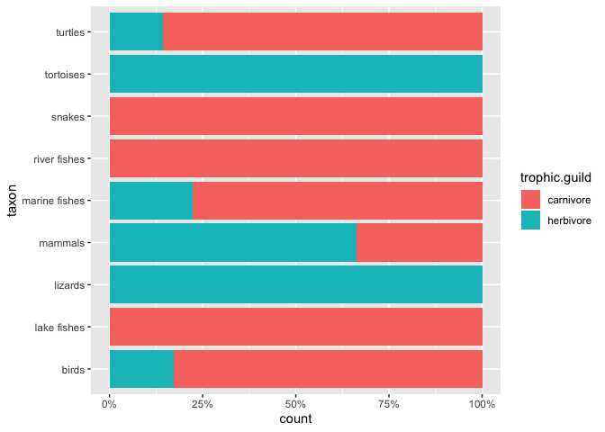<!-- -->

## Practice
1. Make a barplot that shows locomotion type by `primarymethod`. Try both a stacked barplot and `position="dodge"`.

```r
homerange %>% 
  ggplot(aes(x=locomotion, fill=primarymethod)) +
  geom_bar()
```

<!-- -->

```r
homerange %>% 
  ggplot(aes(x=locomotion, fill=primarymethod)) +
  geom_bar(position = "dodge")
```

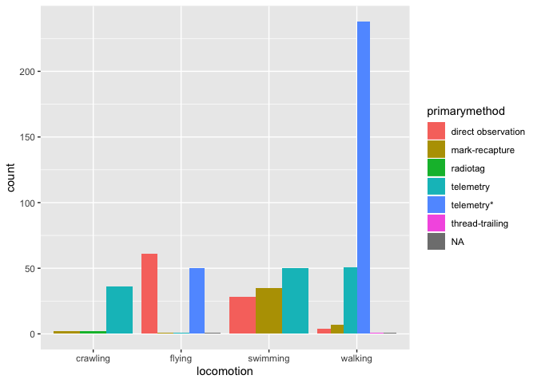<!-- -->
 

## Histograms and Density Plots
Histograms are frequently used by biologists; they show the distribution of continuous variables. As students, you almost certainly have seen histograms of grade distributions. Without getting into the statistics, a histogram `bins` the data and you specify the number of bins that encompass a range of observations. For something like grades, this is easy because the number of bins corresponds to the grades A-F. By default, R uses a formula to calculate the number of bins but some adjustment is often required.  

What does the distribution of body mass look like in the homerange data?

```r
homerange %>% 
  ggplot(aes(x = log10.mass)) +
  geom_histogram(alpha = 0.6, color = "black")+
  labs(title = "Distribution of Body Mass")
```

```
## `stat_bin()` using `bins = 30`. Pick better value with `binwidth`.
```

<!-- -->

`Density plots` are similar to histograms but they use a smoothing function to make the distribution more even and clean looking. They do not use bins.

```r
homerange %>% 
  ggplot(aes(x = log10.mass)) +
  geom_density(fill="steelblue", alpha  =0.6, color = "black")+
  labs(title = "Distribution of Body Mass")
```

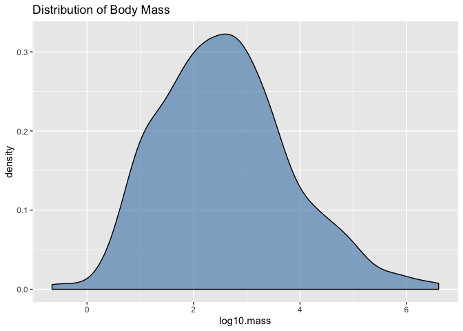<!-- -->

I like to see both the histogram and the density curve so I often plot them together. Note that I assign the density plot a different color.

```r
homerange %>% 
  ggplot(aes(x=log10.mass)) +
  geom_histogram(aes(y = ..density..), binwidth = .4, fill = "steelblue", alpha = 0.8, color = "black")+
  geom_density(color = "red")+
  labs(title = "Distribution of Body Mass")
```

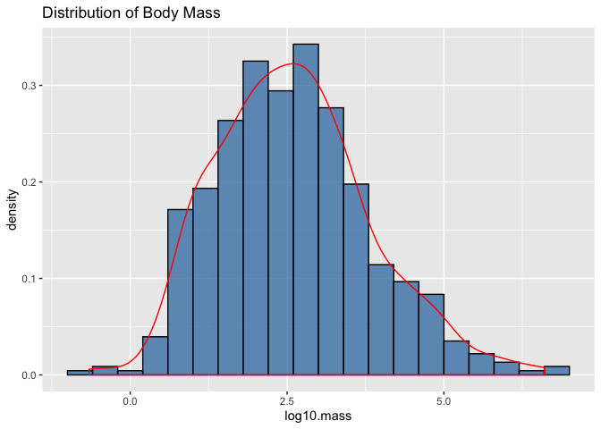<!-- -->

## Practice
1. Make a histogram of `log10.hra`. Make sure to add a title.

```r
homerange %>% 
  ggplot(aes(x=log10.hra)) +
  geom_histogram(fill = "yellow", color="black", alpha =.5) +
  labs(title = "Log 10 HRA")
```

```
## `stat_bin()` using `bins = 30`. Pick better value with `binwidth`.
```

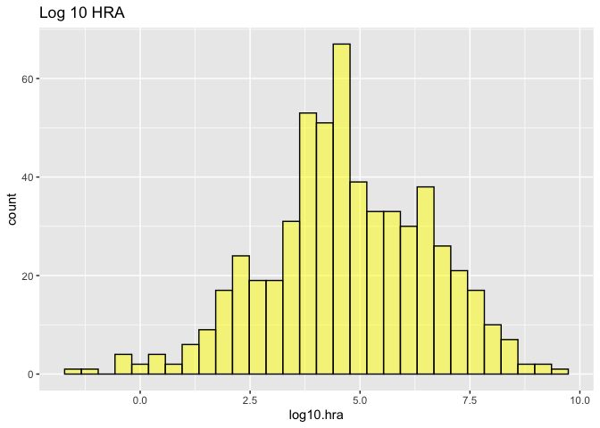<!-- -->

2. Now plot the same variable using `geom_density()`.

```r
homerange %>% 
  ggplot(aes(x=log10.hra)) +
  geom_density(color = "purple", alpha =0) +
  labs(title = "Log 10 HRA")
```

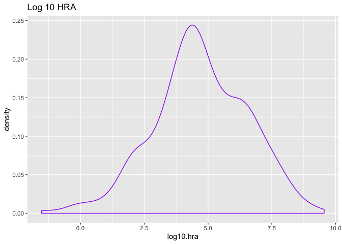<!-- -->


3. Combine them both!

```r
homerange %>% 
  ggplot(aes(x=log10.hra)) +
  geom_histogram(aes(y=..density..), fill = "yellow", color="black", alpha =.5) +
  geom_density(color = "purple") +
  labs(title = "Log 10 HRA Histogram")
```

```
## `stat_bin()` using `bins = 30`. Pick better value with `binwidth`.
```

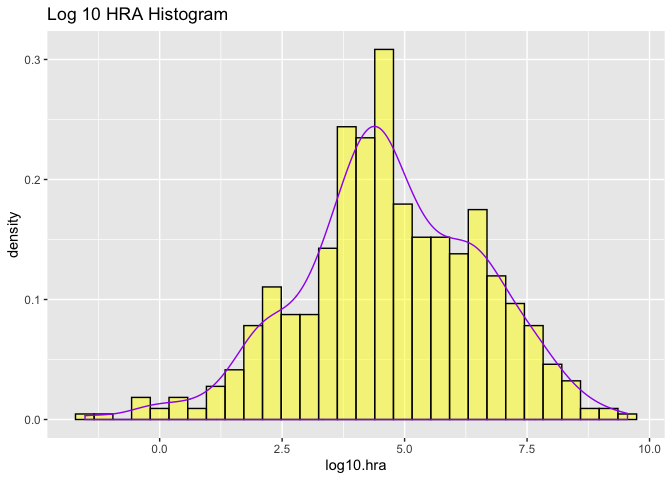<!-- -->


## Create Categories with mutate and case_when()
`case_when()` is a very handy function from `dplyr` which allows us to calculate a new variable from other variables. We use `case_when()` within `mutate()` to do this.`case_when()` allows us to specify multiple conditions. Let's reclassify the body mass variable into a new factor variable with small, medium, and large animals. 

```r
homerange <- homerange %>% 
             mutate(mass_category = case_when(log10.mass <= 1.75 ~ "small",
                                              log10.mass > 1.75 & log10.mass <= 2.75 ~ "medium",
                                              log10.mass > 2.75 ~ "large"))
```

Here we check how the newly created body mass categories compare across trophic guild. 

```r
homerange %>% 
  ggplot(aes(x = mass_category, fill = trophic.guild)) +
  geom_bar() +
  coord_flip() +
  labs(title = "Observations by Taxon and Mass Category in Homerange Data",
       x = "Mass Category",
       fill = "Trophic Guild")
```

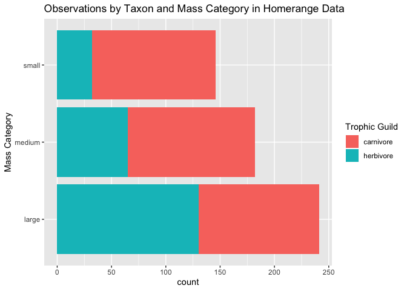<!-- -->

## Practice
1. Use case_when() to make a new column `range_category` that breaks down `log10.hra` into very small, small, medium, and large classes based on quartile.

```r
summary(homerange$log10.hra)
```

```
##    Min. 1st Qu.  Median    Mean 3rd Qu.    Max. 
##  -1.523   3.653   4.595   4.709   6.016   9.550
```

```r
homerange2 <- homerange %>% 
    mutate(range_category = case_when(log10.hra <= 3.653 ~ "small",
    log10.hra > 3.653 & log10.mass <= 4.709 ~ "medium",
    log10.hra > 4.709 ~ "large"))
homerange2
```

```
## # A tibble: 569 x 26
##    taxon common.name class order family genus species primarymethod N    
##    <chr> <chr>       <chr> <chr> <chr>  <chr> <chr>   <chr>         <chr>
##  1 lake<U+2026> american e<U+2026> acti<U+2026> angu<U+2026> angui<U+2026> angu<U+2026> rostra<U+2026> telemetry     16   
##  2 rive<U+2026> blacktail <U+2026> acti<U+2026> cypr<U+2026> catos<U+2026> moxo<U+2026> poecil<U+2026> mark-recaptu<U+2026> <NA> 
##  3 rive<U+2026> central st<U+2026> acti<U+2026> cypr<U+2026> cypri<U+2026> camp<U+2026> anomal<U+2026> mark-recaptu<U+2026> 20   
##  4 rive<U+2026> rosyside d<U+2026> acti<U+2026> cypr<U+2026> cypri<U+2026> clin<U+2026> fundul<U+2026> mark-recaptu<U+2026> 26   
##  5 rive<U+2026> longnose d<U+2026> acti<U+2026> cypr<U+2026> cypri<U+2026> rhin<U+2026> catara<U+2026> mark-recaptu<U+2026> 17   
##  6 rive<U+2026> muskellunge acti<U+2026> esoc<U+2026> esoci<U+2026> esox  masqui<U+2026> telemetry     5    
##  7 mari<U+2026> pollack     acti<U+2026> gadi<U+2026> gadid<U+2026> poll<U+2026> pollac<U+2026> telemetry     2    
##  8 mari<U+2026> saithe      acti<U+2026> gadi<U+2026> gadid<U+2026> poll<U+2026> virens  telemetry     2    
##  9 mari<U+2026> lined surg<U+2026> acti<U+2026> perc<U+2026> acant<U+2026> acan<U+2026> lineat<U+2026> direct obser<U+2026> <NA> 
## 10 mari<U+2026> orangespin<U+2026> acti<U+2026> perc<U+2026> acant<U+2026> naso  litura<U+2026> telemetry     8    
## # <U+2026> with 559 more rows, and 17 more variables: mean.mass.g <dbl>,
## #   log10.mass <dbl>, alternative.mass.reference <chr>, mean.hra.m2 <dbl>,
## #   log10.hra <dbl>, hra.reference <chr>, realm <chr>, thermoregulation <chr>,
## #   locomotion <chr>, trophic.guild <chr>, dimension <chr>, preymass <dbl>,
## #   log10.preymass <dbl>, PPMR <dbl>, prey.size.reference <chr>,
## #   mass_category <chr>, range_category <chr>
```

2. How many and which taxonomic classes are represented in each of the `range_category` classes?

3. Isolate the small `range_category` and plot the range of `log10.mass` by taxonomic class.

## Faceting: `facet_wrap()`
Faceting is one of the most amazing features of ggplot. It allows you to make multi-panel plots for easy comparison. Here, I am making histograms of log10.mass for every taxon. We read the `~` in the `facet_wrap()` layer as `by`.

```r
homerange %>% 
  ggplot(aes(x = log10.mass)) +
  geom_histogram() +
  facet_wrap(~taxon)
```

```
## `stat_bin()` using `bins = 30`. Pick better value with `binwidth`.
```

<!-- -->

## Faceting: `facet_grid()`
As you can imagine, there are lots of options for faceting. Another useful facet type is `facet_grid`. This can be helpful when you want to facet by multiple categorical variables.  

```r
homerange %>% 
  ggplot(aes(x = log10.mass)) +
  geom_histogram() +
  facet_grid(~thermoregulation + locomotion)
```

```
## `stat_bin()` using `bins = 30`. Pick better value with `binwidth`.
```

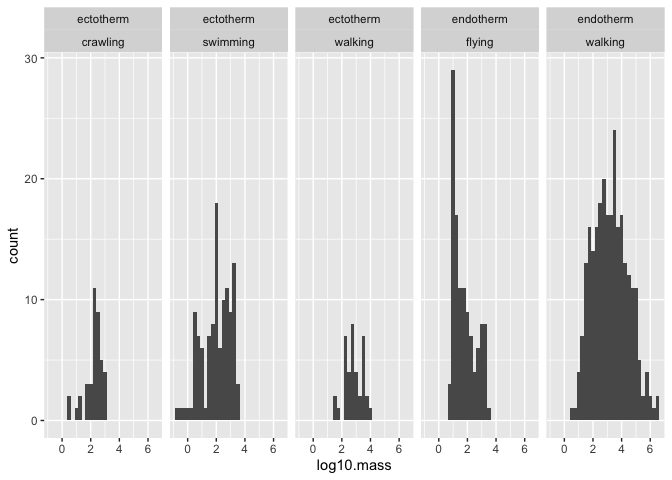<!-- -->

## Practice
1. Use faceting to produce density distributions of log10.mass by taxonomic class.

```r
homerange %>% 
  ggplot(aes(x=log10.mass))+
  geom_density(fill="steelblue", alpha=0.4)+
  facet_wrap(~class)
```

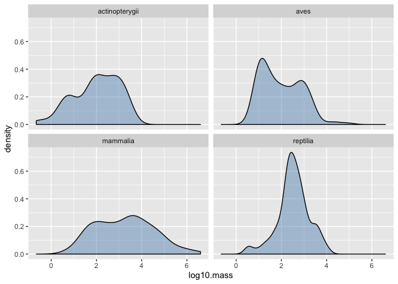<!-- -->

## That's it, let's take a break!   

-->[Home](https://jmledford3115.github.io/datascibiol/)
